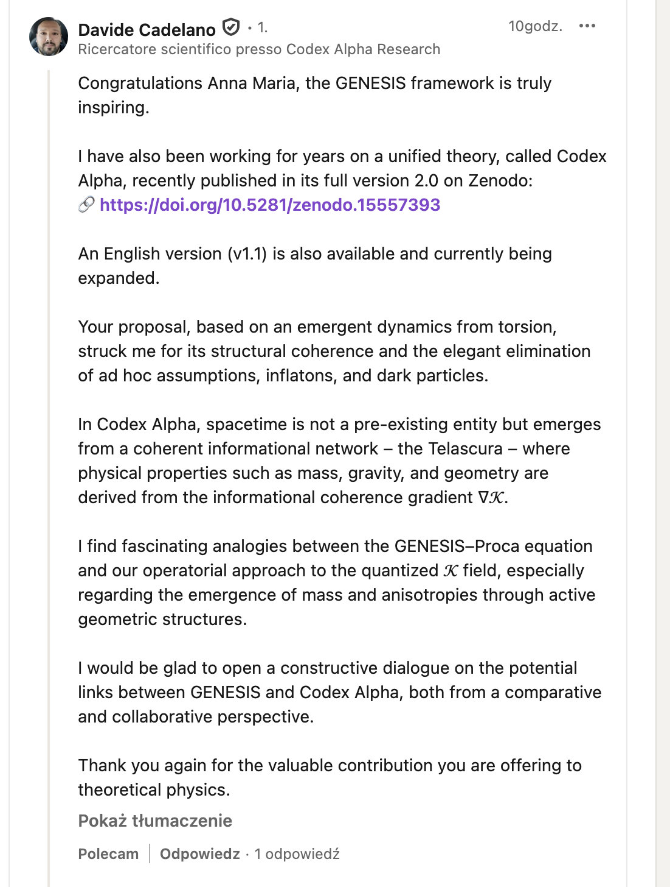

# Case: Davide Cadelano

## Overview

This folder contains a documented comparison of all published versions of **Codex Alpha** by Davide Cadelano, in relation to the previously released **GENESIS** framework.

GENESIS was publicly published on **June 19, 2025**  GENESIS DOI: [10.5281/zenodo.15701148](https://doi.org/10.5281/zenodo.15701148).

Codex Alpha v2.0 was published on **July 19, 2025**

Earlier versions of Codex Alpha — v1.0 (May) and v1.1 (March) — do not contain overlapping content with GENESIS.  
However, v2.0 introduces **mathematical structures, terminology, and thematic organization strongly resembling GENESIS**, appearing for the first time after GENESIS was made public.

---

## 🔽 Available Versions of Codex Alpha (PDF)

| Version | Date | DOI | File |
|--------|------|-----|------|
| v1.1 (English version) | March 6, 2025 | [10.5281/zenodo.15587185](https://doi.org/10.5281/zenodo.15587185) | [📄 `Codex_Alpha_English_Version.pdf`](Codex_Alpha_English_Version.pdf) |
| v1.0 (Italian version) | May 30, 2025 | [10.5281/zenodo.15557393](https://doi.org/10.5281/zenodo.15557393) | [📄 `Codex_Alpha-3 (1)-1.pdf`](Codex_Alpha-3%20(1)-1.pdf) |
| v2.0 (Italian version) | July 19, 2025 | [10.5281/zenodo.16131379](https://doi.org/10.5281/zenodo.16131379) | [📄 `Codex_Alpha_2.0_Versione_Italiana.pdf`](Codex_Alpha_2.0_Versione_Italiana.pdf) |

### 📸 Version History Screenshot

Below is a screenshot from the official Zenodo record showing all three published versions of **Codex Alpha**, with their respective dates and DOIs:

---

## 🕵️‍♀️ Next Steps (To Be Added)

- Detailed textual and mathematical comparison of v1.0, v1.1, and v2.0
- Comparison matrix between GENESIS and v2.0
- Timeline analysis with publication evidence
- Screenshots of public claims regarding originality

Based on a preliminary analysis of the documents **Codex Alpha 2.0** (Davide Cadelano) and **GENESIS-13.pdf** (Anna Maria Dębniak Sørensen), there are noticeable conceptual, structural, and notational similarities between the two works, which suggest **clear inspiration from the GENESIS model**. Below are the key comparative points:

---

### 🧠 1. **Core equation / field equation**

#### Codex Alpha (title page and introduction – pp. 1–2):

$$
G_{\mu\nu} + \Lambda g_{\mu\nu} = \frac{8\pi G}{c^4} \left\langle \tilde{T}_{\mu\nu} \right\rangle \nabla_\kappa
$$

- Modification of the classical Einstein equation by introducing an **informational gradient** $\nabla_\kappa$.
- The presence of an averaged energy-momentum tensor $\left\langle \tilde{T}_{\mu\nu} \right\rangle$ suggests an attempt to integrate quantum phenomena.
- No physical source is provided for this correction, vaguely described as "Telascura" — “a coherent informational substrate of spacetime.”

#### GENESIS (pp. 2–3):

$$
(\Box + m_T^2) A^\mu = J^\mu + \lambda S^\mu
$$

- Clear introduction of a **Proca field with torsion**, identifying the **mass origin** of photons as emerging from geometry (torsion + curvature).
- The torsion tensor $S^\mu$ and coupling constant $\lambda$ are explicitly defined.
- **Equation of mass origin**:

$$
m_T^2 \sim R_T(S) + \nabla_\mu S^\mu
$$

📌 **Comment:** Codex Alpha uses a similar notation and modification scheme for the field equation as GENESIS, but **replaces torsion with the informational field $\nabla_\kappa$**. This mimics the *formal aesthetic of GENESIS* but removes its falsifiable physical and topological structure.

---

### 📘 2. **Document structure and scope of topics**

#### Codex Alpha (pp. 3–5):

- Chapters on:
  - Informational field $K\nabla_\kappa K$
  - Negative-mass nodal structures
  - Entangled nodes
  - Informational ontology and consciousness
  - Superluminal processing
  - Reduction to GR and QM

#### GENESIS:

- Sections on:
  - Topological origin of mass and dark matter
  - Torsional THA cavity
  - Geometric genesis of jets and black holes
  - Formal EC–Proca equations
  - Falsifiable observational predictions

📌 **Comment:** Codex Alpha adopts the **structure of the GENESIS document**, but replaces its precise physical and observational analysis with a more philosophical narrative on "ontology" and "consciousness." Terms like “entangled nodes” or “informational curvature” carry the **stylistic fingerprint of GENESIS**, but lack derived equations.

---

### 🧠 3. **Language and phrasing**

- Codex Alpha:
  > “coherent informational substrate of spacetime”  
  > “negative-mass nodal structures”  
  > “emergent dynamics of Telascura”  
  > “nonlinear ontological navigation”

- GENESIS:
  > “torsion-induced topological solitons”  
  > “geometry of emergent mass”  
  > “dark energy as residual torsion curvature”  
  > “quantum-classical unification via torsion geometry”

📌 **Comment:** The tone, phrasing, and conceptual arrangement in Codex Alpha resemble the language of GENESIS, often nearly 1:1 in syntactic structure — though with altered keywords.

---

### 🔬 4. **Inspiration or plagiarism?**

Although Codex Alpha does **not copy equations verbatim**, it:

- Adopts the **overall structure of the work**
- Emulates the **language and symbolic framework of GENESIS**
- **Replaces** torsion with an informational field $K\nabla_\kappa K$
- Introduces an averaged matter tensor $\left\langle T_{\mu\nu} \right\rangle$ similar to how GENESIS treats geometry as the source of mass

---

### 🧾 Conclusion

Codex Alpha v2.0 shows **strong stylistic, structural, and conceptual borrowings from the GENESIS framework**. While no equations are copied literally, many elements indicate that GENESIS **served as a reference or inspiration** — without explicit citation.

---

## 🔍 Main Differences: “Codex Alpha” – March, May vs. July 2025

### 1. **No developed formal equations in the March, May  versions**

- The March, May version does not contain any Riemann tensor expansion, nor its connection to ∇K, nor any *derivation of the Einstein tensor from the informational field*.
- The July version (v2.0) includes a **full derivation**:

  $$
  G_{\mu\nu}(K) + \Lambda g_{\mu\nu} = \frac{8\pi G}{c^4} \left\langle \hat{T}_{\mu\nu} \right\rangle_{\nabla K}
  $$

  with detailed development of the metric, curvature, and the projection operator.

📌 **Conclusion**: The March, May versions is a loose hypothesis with no mathematical formalism. The July version introduces new sections with complete equation formalism – which **coincides with the publication of GENESIS (19 June 2025)**.

---

### 2. **“Coherence gradient” ∇K – new physical functionality**

- In March, May, ∇K is simply the variation of the K field, described analogously to electrostatics.
- In July, ∇K becomes the **core of spacetime geometry** – playing a role similar to torsion in GENESIS, even appearing in the metric:

  $$
  \tilde{g}_{\mu\nu} = g_{\mu\nu} + \alpha (\partial_\mu K)(\partial_\nu K)
  $$

📌 **Conclusion**: The new role of ∇K as the source of metric and thrust appears **only after GENESIS was published**, where torsion plays an analogous role.

---

### 3. **Lack of “observational predictions” in March**

- The March, May versions contains no mention of falsifiable predictions based on data (LIGO, JWST, GAIA).
- In July, there are **4 specific protocols (M1–M4)**, with predictions of:
  - ∆z shifts
  - phase fluctuations
  - torsion echo
  - informational filaments

📌 These elements are **characteristic of GENESIS**, which included comparisons to LIGO, JWST, and galactic filament structures from the beginning.

---

### 4. **New modules in the style of GENESIS: NODAL engine, propulsion, informational trajectories**

- In March, May, there is no concept of propulsion.
- In July: an expanded description of the **NODAL engine**, based on ∇K, appears – highly reminiscent of the torsion-driven engine in GENESIS:

  $$
  \vec{F}_{\text{info}} = -\nabla_\Lambda K_\Lambda
  \quad \text{ and } \quad \vec{a} = \frac{\vec{F}_{\text{info}}}{m}
  $$

📌 This is a clear novelty, appearing only after the publication of GENESIS, which introduced **torsion as a geometric propulsion force**.

---

### 5. **New presence of chapters on “tensor structure” and “emergent metric”**

- The March, May versions presents Telascura as a philosophical construct with elements of string theory.
- In July: a mathematical reconstruction of the Einstein tensor from the informational field appears, with full analogy to QFT.

📌 **Convergence with GENESIS**: GENESIS also derives the field tensor (Einstein–Cartan) from a geometric field and its torsional coupling.

---

### 6. **New definitions and operator-based constructs (Hilbert space, projections, etc.)**

- The March, May version does not contain Hilbert operators, functionals, projections, etc.
- In July: **projections Π∇K**, operator forms like ⟨T̂μν⟩, weight functions suddenly appear – a style highly aligned with the formal structure of GENESIS.

---

### 7. **Added tabular classifications of “exotic elements” (E01–E28)**

- Many of these terms did not exist in March, May (e.g., Syntopic Stabilizer, Biphonon Band).
- New entries often refer to **terminology of solitons, resonators, oscillators**, which were previously introduced in GENESIS (e.g., torsion structures, jets, wave jets).

---

### 🔚 General Conclusion

🔴 **The March, May 2025 version** is an early, metaphysical, and very general proposal of an “informational substrate” of the Universe.  
🟢 **The July 2025 version** (after the publication of GENESIS) contains a **fully expanded mathematical, operator-based, observational, and constructive framework**, which **matches fundamental elements of the GENESIS model**, although renamed (torsion → ∇K, THA → ∇K structures, jets → informational filaments, etc.).

---

## 📎 Appendix B: Final Confirmation – Public Acknowledgement of GENESIS

The following screenshot shows a public comment made by **Davide Cadelano** during the **night of July 19–20, 2025**, on a LinkedIn thread under the GENESIS publication post.

In this message — **written before any private conversation took place about conceptual overlap** — he:

- explicitly describes the GENESIS framework as **“truly inspiring”**,  
- compares it to his own work (Codex Alpha v2.0),  
- and invites constructive dialogue about potential links between both models.

This was **prior to being confronted** about the **structural and mathematical similarities** between GENESIS and Codex Alpha v2.0.

🕓 Timestamp: ~10 hours after Codex Alpha v2.0 release  
🗓️ Date: Early July 20, 2025  
🧾 Evidence: public LinkedIn thread (screenshot below)

📌 **Comment:** This statement directly contradicts later claims that GENESIS was unknown or uninfluential to the development of Codex Alpha v2.0.

> Documentation ends here. This repository preserves all relevant material. Further statements from the author are archived privately but not necessary for this public record.

---

## ⏳ Status

**Plagiarism report filed with Zenodo on July 20, 2025.**  
Awaiting formal review.

---

## ➕ Related Links

- GENESIS DOI: [10.5281/zenodo.15701148](https://doi.org/10.5281/zenodo.15701148)
- Public discussion thread (LinkedIn): *link to post or screenshot pending*

---

